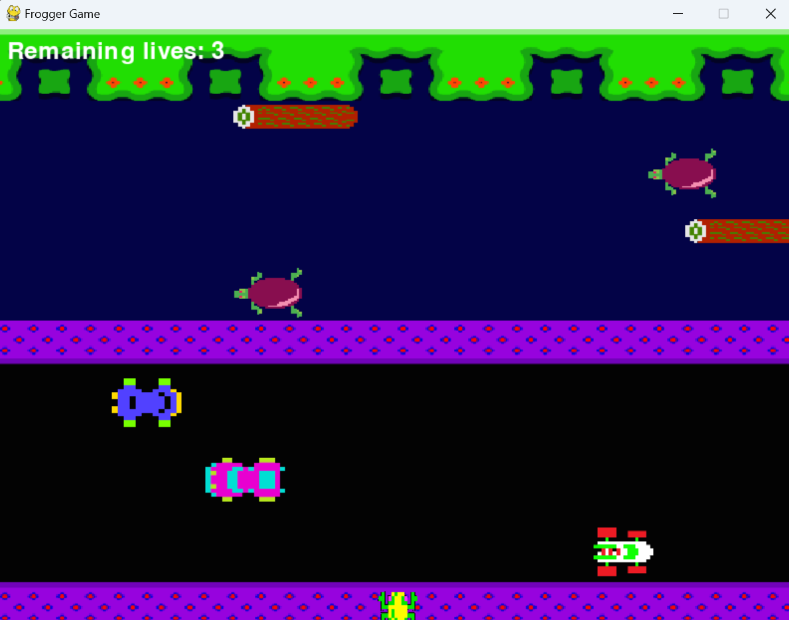

# Frogger with Pygame


This is a simple frog game implemented in python using the pygame library. See if u can reach the end.
## Features
- Frogger is a single player game.
- Contains a horizontal road occupied by speeding cars and a river with turtles and logs.
- has nice game music.
- lives tracking.
## Installation
1. Clone this repository:
   ```bash
   git clone https://github.com/tanzzard/Cap2_Pygame.git
# How to play
- Use the arrow keys to move the frog.
- Avoid the cars and jump on the logs and turtles to cross the river.
- Reach the other side to win the game.

  
